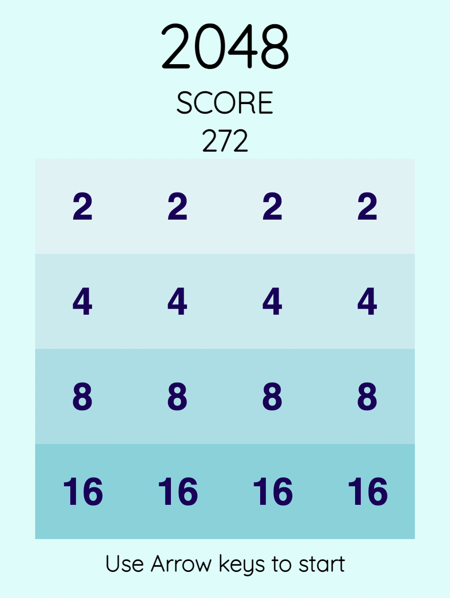

# 2048 in JS.

### 2048 game implemented in vanila JS and HTML/CSS.

#### Module Used.

#### Font Used : [Quicksand](https://fonts.google.com/specimen/Quicksand)
#### Hosted on : [Netlify](https://2048js.netlify.app/)

<!-- {:width="50px"}
{:width="50px"} -->

